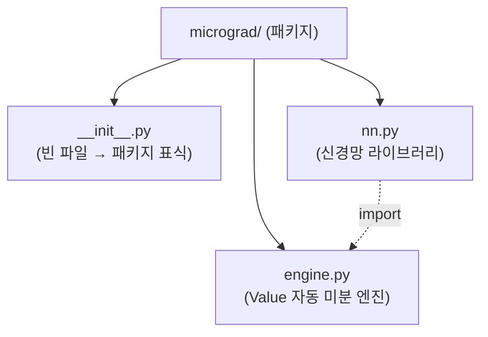

# __init__.py 분석

## 개요

`micrograd/__init__.py`는 **빈 파일**입니다. 내용이 없지만, 이 파일의 존재만으로 `micrograd` 디렉터리가 파이썬의 **패키지(package)**로 인식됩니다.

## 역할

이 파일이 있기 때문에 다음과 같은 임포트가 가능합니다:

```python
from micrograd.engine import Value
from micrograd.nn import MLP, Layer, Neuron
from micrograd import nn
```

## 패키지 구조 다이어그램



## 참고

이 파일에 심볼을 명시적으로 노출(예: `from .engine import Value`)하도록 작성할 수도 있지만, micrograd는 의도적으로 최소한의 구성을 유지하기 위해 비워 두었습니다. 사용자는 전체 경로(`micrograd.engine`, `micrograd.nn`)를 통해 필요한 것을 직접 임포트합니다.
