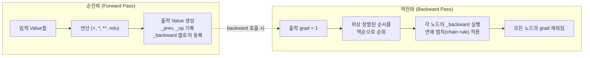
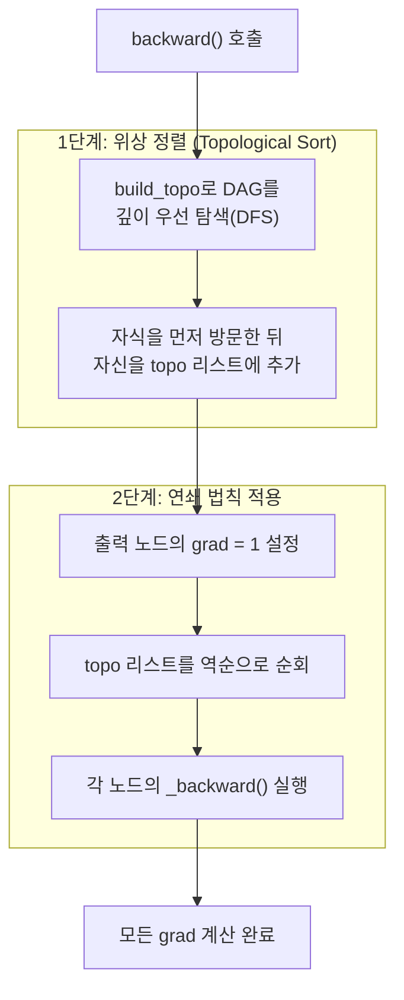

# engine.py 분석

## 개요

`engine.py`는 micrograd의 핵심인 **자동 미분(autograd) 엔진**을 구현합니다. 단 하나의 클래스 `Value`로 이루어져 있으며, 이 클래스는 하나의 스칼라 값과 그 값에 대한 그래디언트(미분값)를 저장합니다. 연산(`+`, `*`, `**`, `relu` 등)을 수행할 때마다 연산 그래프(DAG)가 동적으로 구성되고, `backward()`를 호출하면 역전파(reverse-mode autodiff)를 통해 모든 그래디언트가 계산됩니다.

## `Value` 클래스 구조

각 `Value` 객체가 저장하는 정보:

| 속성 | 설명 |
|------|------|
| `data` | 실제 스칼라 값 |
| `grad` | 이 값에 대한 그래디언트 (초기값 0) |
| `_backward` | 이 노드의 지역 그래디언트를 부모(자식 입력)에게 전파하는 함수 (기본값: no-op) |
| `_prev` | 이 값을 만든 입력 노드들의 집합 (그래프의 간선) |
| `_op` | 이 노드를 만든 연산의 이름 (디버깅 / graphviz 시각화용) |

## 순전파(Forward)와 역전파(Backward)의 관계

각 연산은 **순전파 시 결과 `Value`를 생성**하고, 동시에 **역전파를 위한 `_backward` 클로저를 등록**합니다.



## 지원 연산과 지역 그래디언트

각 연산이 등록하는 `_backward`는 연쇄 법칙에 따라 지역 미분을 부모의 그래디언트에 누적(`+=`)합니다. `+=`를 사용하는 이유는 한 노드가 여러 경로에서 사용될 수 있기 때문입니다(다변수 연쇄 법칙).

| 연산 | 순전파 (`out.data`) | 역전파 (지역 그래디언트) |
|------|--------------------|--------------------------|
| `__add__` (`+`) | `self.data + other.data` | `self.grad += out.grad`, `other.grad += out.grad` |
| `__mul__` (`*`) | `self.data * other.data` | `self.grad += other.data * out.grad`, `other.grad += self.data * out.grad` |
| `__pow__` (`**n`) | `self.data ** n` | `self.grad += (n * self.data**(n-1)) * out.grad` |
| `relu` | `max(0, self.data)` | `self.grad += (out.data > 0) * out.grad` |

그 외 `__neg__`, `__sub__`, `__truediv__` 등은 위의 기본 연산들의 조합으로 구현됩니다 (예: `a - b = a + (-b)`, `a / b = a * b**-1`).

## `backward()` 동작 방식

`backward()`는 두 단계로 이루어집니다.



**핵심 아이디어**: 그래프가 비순환(acyclic)이기 때문에 위상 정렬이 가능하고, 이를 역순으로 처리하면 어떤 노드를 처리하는 시점에는 그 노드의 그래디언트(`out.grad`)가 이미 모두 누적되어 있음이 보장됩니다.

## 사용 예시

```python
from micrograd.engine import Value

a = Value(-4.0)
b = Value(2.0)
c = a + b        # c.data = -2.0, c._prev = {a, b}, c._op = '+'
d = a * b + b**3 # 연산 그래프가 동적으로 확장됨
g = (c - d)**2
g.backward()     # a.grad, b.grad 등이 채워짐
print(a.grad, b.grad)
```
