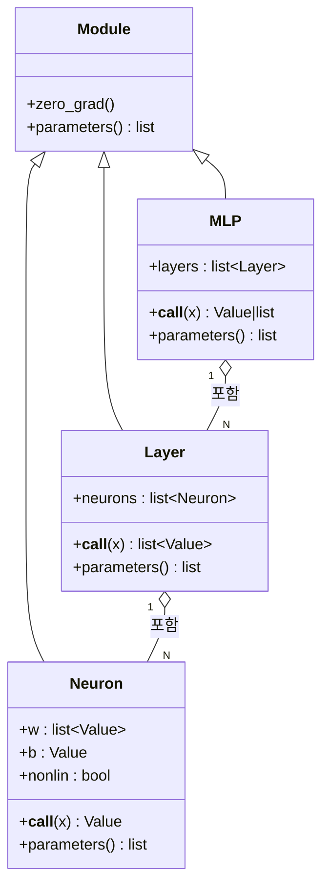
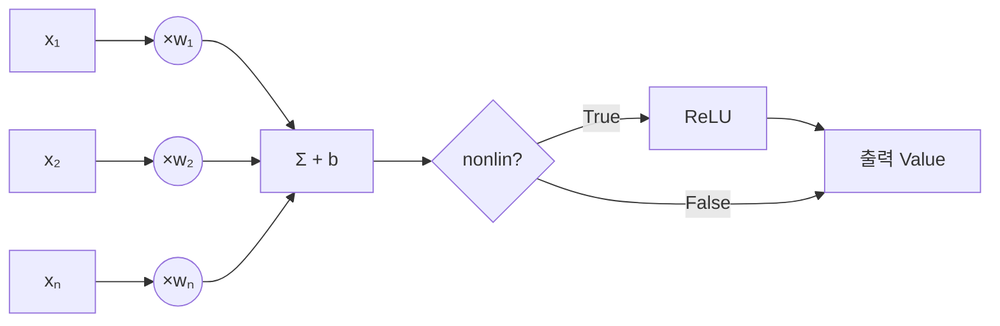
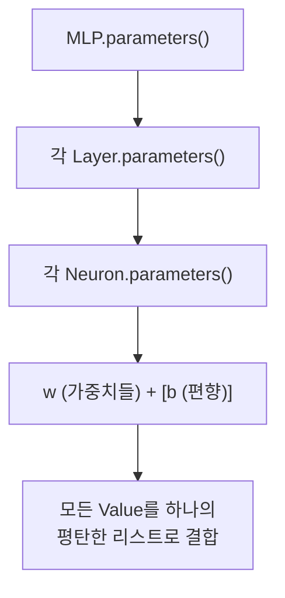

# nn.py 분석

## 개요

`nn.py`는 `engine.py`의 `Value` 자동 미분 엔진 위에 얹은 **작은 신경망 라이브러리**입니다. PyTorch와 유사한 API를 제공하며, 뉴런(Neuron) → 층(Layer) → 다층 퍼셉트론(MLP)의 계층 구조로 신경망을 구성합니다. 모든 계산은 스칼라 `Value` 단위로 이루어지므로 자동으로 역전파가 가능합니다.

## 클래스 계층 구조



- **`Module`**: 모든 구성 요소의 기반 클래스. `zero_grad()`(모든 파라미터의 그래디언트를 0으로 초기화)와 `parameters()`(파라미터 목록 반환, 기본은 빈 리스트)를 제공합니다.
- **`Neuron`**: 하나의 뉴런. 가중치 `w`(입력 개수만큼), 편향 `b`를 가집니다.
- **`Layer`**: 여러 뉴런을 병렬로 묶은 하나의 층.
- **`MLP`**: 여러 층을 직렬로 쌓은 전체 신경망.

## 단일 뉴런(Neuron)의 계산

각 뉴런은 입력의 가중합에 편향을 더한 뒤(활성화 이전 값, `act`), 필요하면 ReLU 비선형성을 적용합니다.

$$ \text{out} = \text{ReLU}\left(\sum_i w_i x_i + b\right) $$



## MLP 전체 데이터 흐름

`MLP(nin, nouts)`는 입력 크기 `nin`과 각 층의 출력 크기 리스트 `nouts`로 구성됩니다. 마지막 층을 제외한 모든 층은 ReLU 비선형성을 사용하고(`nonlin=True`), **마지막 층은 선형(linear)**으로 둡니다(`nonlin = i != len(nouts)-1`).

예: `MLP(2, [16, 16, 1])` — 2차원 입력, 16노드 은닉층 2개(ReLU), 1개 선형 출력.


`__call__`은 각 층에 입력을 순차적으로 통과시킵니다:

```python
def __call__(self, x):
    for layer in self.layers:
        x = layer(x)
    return x
```

## 파라미터 수집

`parameters()`는 하위 구성 요소의 파라미터를 재귀적으로 평탄화(flatten)하여 하나의 리스트로 모읍니다. 이 리스트는 SGD 등 최적화에서 그래디언트 갱신 대상이 됩니다.



## 학습 루프에서의 역할 (개념)

```python
from micrograd.nn import MLP

model = MLP(2, [16, 16, 1])   # 신경망 생성
# 학습 반복:
#   1. y_pred = model(x)      -> 순전파 (연산 그래프 구성)
#   2. loss = ...             -> 손실 계산
#   3. model.zero_grad()      -> 이전 그래디언트 초기화
#   4. loss.backward()        -> 역전파 (engine.py가 담당)
#   5. p.data -= lr * p.grad  -> 파라미터 갱신 (SGD)
```
