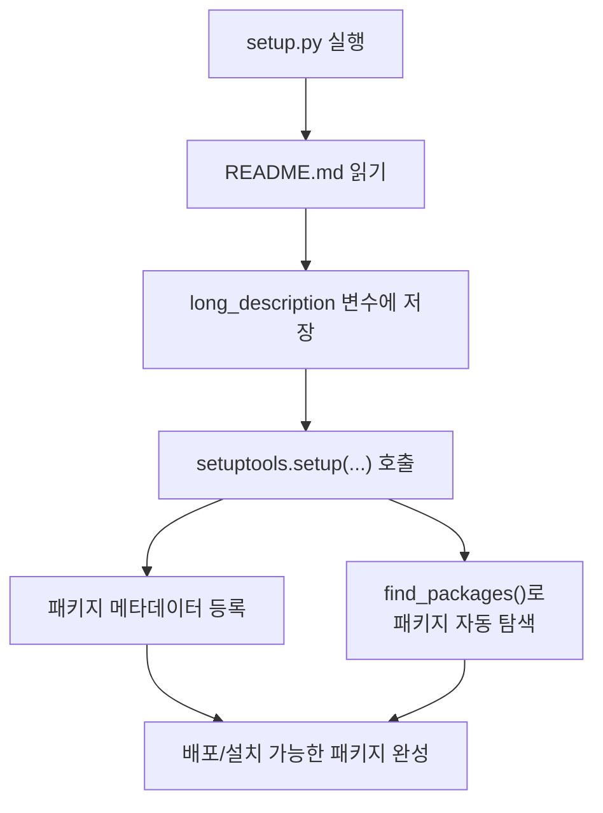

# setup.py 분석

## 개요

`setup.py`는 `setuptools`를 사용하여 micrograd를 **설치 가능한 파이썬 패키지로 배포**하기 위한 설정 파일입니다. `pip install micrograd`나 로컬 설치 시 이 파일이 패키지의 메타데이터와 구성을 정의합니다.

## 동작 흐름

## 주요 설정 항목

| 항목 | 값 / 설명 |
|------|-----------|
| `name` | `"micrograd"` — 패키지 이름 |
| `version` | `"0.1.0"` — 버전 |
| `author` / `author_email` | Andrej Karpathy |
| `description` | 패키지 한 줄 설명 |
| `long_description` | `README.md`의 전체 내용 (PyPI 페이지에 표시) |
| `long_description_content_type` | `"text/markdown"` — README가 마크다운임을 명시 |
| `url` | GitHub 저장소 주소 |
| `packages` | `find_packages()` — 하위 패키지 자동 검색 |
| `classifiers` | Python 3, MIT 라이선스, OS 독립적 등 분류 태그 |
| `python_requires` | `'>=3.6'` — 최소 파이썬 버전 |

## README와의 연결

`setup.py`는 `README.md`를 읽어 `long_description`으로 사용합니다. 따라서 패키지를 PyPI에 배포하면 README 내용이 프로젝트 소개 페이지로 그대로 표시됩니다.

