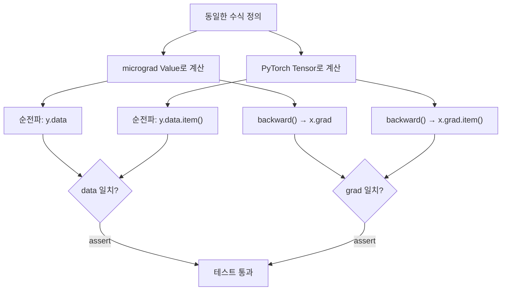
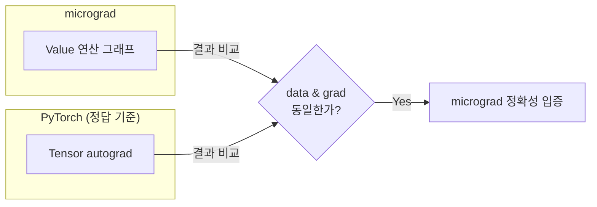

# test_engine.py 분석

## 개요

`test_engine.py`는 micrograd의 자동 미분 엔진(`engine.py`)이 **올바르게 동작하는지 검증하는 단위 테스트**입니다. 핵심 전략은 동일한 계산을 micrograd와 **PyTorch** 양쪽에서 각각 수행한 뒤, 순전파 결과(`data`)와 역전파 결과(`grad`)가 일치하는지 비교하는 것입니다. PyTorch를 "정답(reference)"으로 삼습니다.

## 검증 전략



## 테스트 함수

### `test_sanity_check()`

기본적인 연산(`+`, `*`, `relu`)이 포함된 비교적 단순한 수식을 검증합니다.

- micrograd와 PyTorch에서 동일한 수식 `y`를 계산합니다.
- **순전파 검증**: `ymg.data == ypt.data.item()` (정확히 일치)
- **역전파 검증**: `xmg.grad == xpt.grad.item()` (정확히 일치)

### `test_more_ops()`

덧셈, 곱셈, 거듭제곱, 나눗셈, 뺄셈, ReLU 등 **더 다양한 연산**과 복잡한 그래프를 검증합니다.

- 부동소수점 오차를 감안하여 정확한 일치 대신 **허용 오차(`tol = 1e-6`)** 이내인지 확인합니다.
- **순전파 검증**: `abs(gmg.data - gpt.data.item()) < tol`
- **역전파 검증**: `abs(amg.grad - apt.grad.item()) < tol`, `abs(bmg.grad - bpt.grad.item()) < tol`

## 두 테스트 비교

| 항목 | `test_sanity_check` | `test_more_ops` |
|------|---------------------|-----------------|
| 사용 연산 | `+`, `*`, `relu` | `+`, `-`, `*`, `**`, `/`, `relu` |
| 입력 변수 | `x` 하나 | `a`, `b` 두 개 |
| 비교 방식 | 정확히 일치(`==`) | 허용 오차 이내(`< 1e-6`) |
| 목적 | 기본 동작 확인 | 폭넓은 연산 정확성 확인 |

## 실행 방법

테스트는 PyTorch를 참조로 사용하므로 먼저 PyTorch를 설치해야 합니다.

```bash
python -m pytest
```

## 왜 PyTorch와 비교하는가?

PyTorch는 검증된 성숙한 자동 미분 프레임워크입니다. micrograd가 동일한 입력에 대해 PyTorch와 같은 값과 그래디언트를 산출한다면, micrograd의 역전파 구현(연쇄 법칙 적용)이 수학적으로 올바르다는 강력한 증거가 됩니다.


